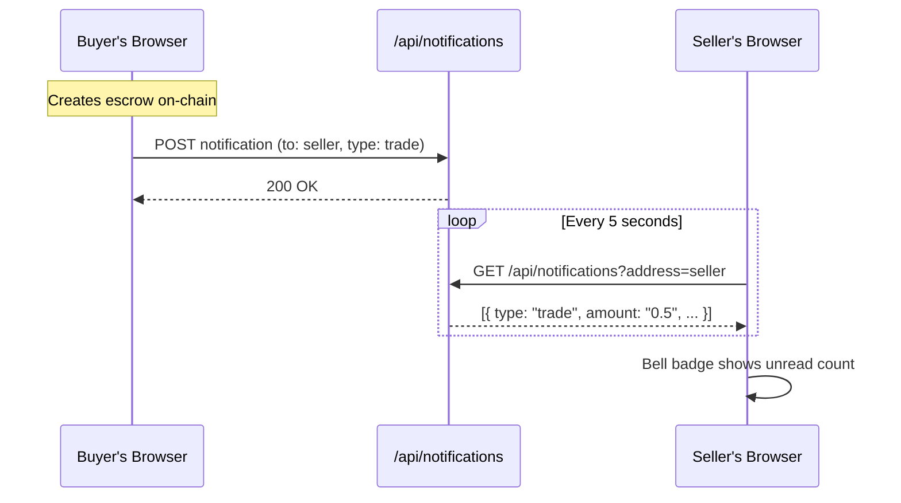

## Overview

VeriPay includes a **real-time notification system** that alerts users when important events occur in their trades. Notifications are **address-targeted** — they're sent to a specific wallet address, not a user account.

## How It Works

### Architecture



### Notification Types

| Type | Trigger | Recipient | Content |
| --- | --- | --- | --- |
| `trade` | New escrow created | Seller | "New Escrow Created — From `0x742d...bD18` · 0.5 MON" |
| `chat` | New chat message | Other party | "New Message · Trade #001 — 'When will you ship?'" |

### Polling Mechanism

The Navbar component polls for notifications every **5 seconds** when a wallet is connected:

```typescript
useEffect(() => {
  if (!account?.address) return;
  fetchNotifications();
  const interval = setInterval(fetchNotifications, 5000);
  return () => clearInterval(interval);
}, [account?.address]);
```

### UI Components

**Bell Icon (Navbar):**
- Shows a pulsing pink badge with unread count
- Click to toggle the notification panel
- Pink background when panel is open

**Notification Panel:**
- Dropdown panel anchored to the bell icon
- Shows all notifications sorted by recency
- Each notification links to the relevant trade detail page
- "Mark All Read" button to clear unread badges
- Unread notifications have a subtle pink background

### Data Structure

```typescript
type Notification = {
  id: number;
  type: "trade" | "chat";
  tradeId: string;
  fromAddress: string;
  amount?: string;       // Only for trade notifications
  message?: string;      // Only for chat notifications
  read: boolean;
  createdAt: string;
};
```

## API Endpoints

### Get Notifications

```http
GET /api/notifications?address=0x742d...bD18
```

**Response:**
```json
{
  "notifications": [
    {
      "id": 1,
      "type": "trade",
      "tradeId": "5",
      "fromAddress": "0xaBcD...1234",
      "amount": "0.5",
      "read": false,
      "createdAt": "2 min ago"
    }
  ]
}
```

### Create Notification

```http
POST /api/notifications
Content-Type: application/json

{
  "toAddress": "0x742d...bD18",
  "type": "trade",
  "tradeId": "5",
  "fromAddress": "0xaBcD...1234",
  "amount": "0.5"
}
```

### Mark All as Read

```http
PATCH /api/notifications
Content-Type: application/json

{
  "address": "0x742d...bD18"
}
```

## Design Decisions

| Decision | Rationale |
| --- | --- |
| Polling (not WebSockets) | Simpler, more reliable, works behind firewalls and on mobile. 5s interval provides near-real-time feel. |
| Address-targeted (not user accounts) | No signup required. Connect wallet = automatically subscribed. |
| Off-chain storage | Notifications are ephemeral and don't affect fund security. Storing on-chain would be wasteful and expensive. |
| Auto-dismiss on close | Panel closes when clicking outside it, keeping the UI clean. |
