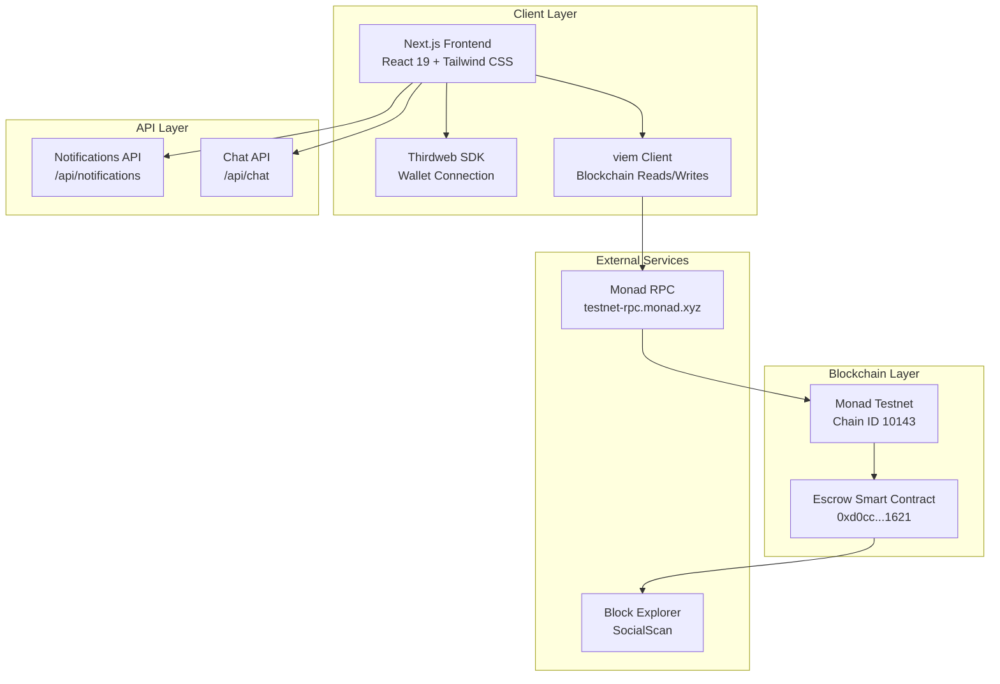
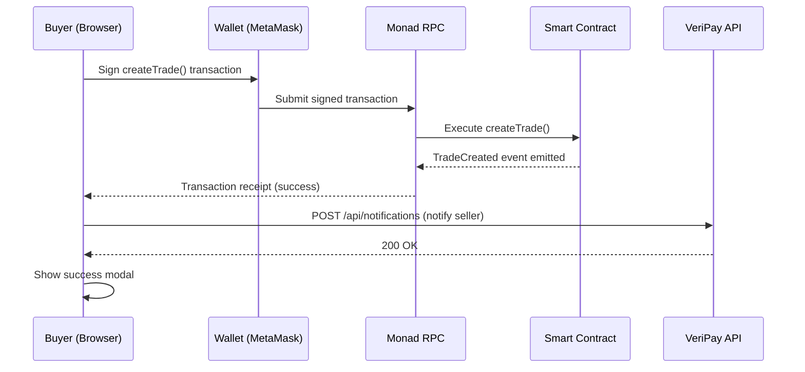
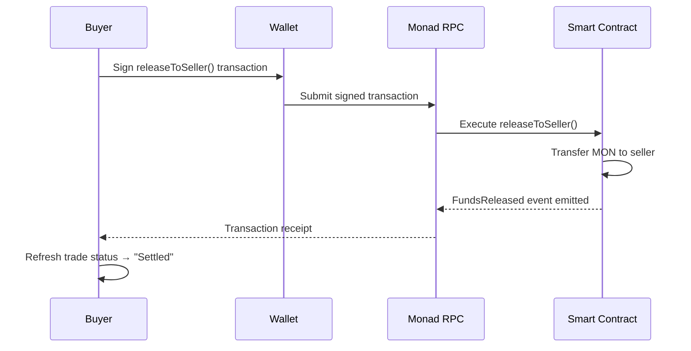
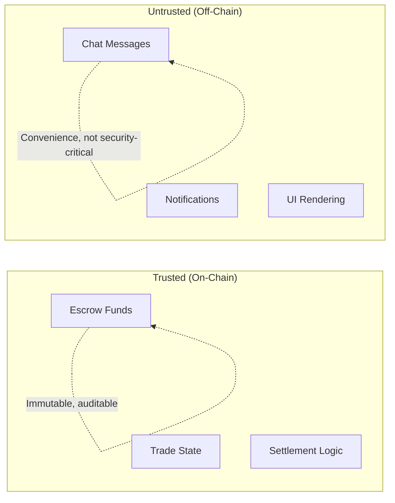

## System Architecture

VeriPay is a **full-stack decentralized application** with three core layers: a Next.js frontend, a Solidity smart contract on Monad, and a lightweight API layer for off-chain features.

### Architecture Diagram

### Layer Breakdown

<CardGroup cols={3}>
  <Card title="Client Layer" icon="browser">
    **Next.js 16 + React 19**

    The user-facing application. Handles all UI rendering, wallet connections, form inputs, and transaction signing. Runs in the user's browser.
  </Card>
  <Card title="Smart Contract" icon="file-contract">
    **Solidity on Monad**

    The on-chain escrow logic. Holds funds, enforces trade rules, and emits events. Fully immutable and permissionless.
  </Card>
  <Card title="API Layer" icon="server">
    **Next.js API Routes**

    Lightweight REST APIs for off-chain features: notifications and chat messages. These don't handle funds — they only facilitate communication.
  </Card>
</CardGroup>

## Data Flow

### Creating an Escrow

### Releasing Funds

## Key Design Decisions

### Why On-Chain for Escrow?

| Decision | Rationale |
| --- | --- |
| Funds held by smart contract | Eliminates need to trust VeriPay (or any company) with user funds |
| No admin keys on contract | Prevents rug pulls, insider theft, or unauthorized fund access |
| Two-party refund consent | Prevents unilateral abuse by either buyer or seller |
| On-chain metadata | Trade descriptions are permanently recorded and verifiable |

### Why Off-Chain for Chat & Notifications?

| Decision | Rationale |
| --- | --- |
| Chat via API routes | On-chain messages would be expensive (gas) and slow for real-time conversation |
| Notifications via polling | Simple, reliable, no WebSocket complexity; 5-second polling interval |
| No user accounts | Wallet address = identity. No signup, no passwords, no databases of personal info |

## Security Architecture

The critical security boundary is clear: **anything involving money happens on-chain**. Off-chain features (chat, notifications) are convenience layers that don't affect fund safety.
