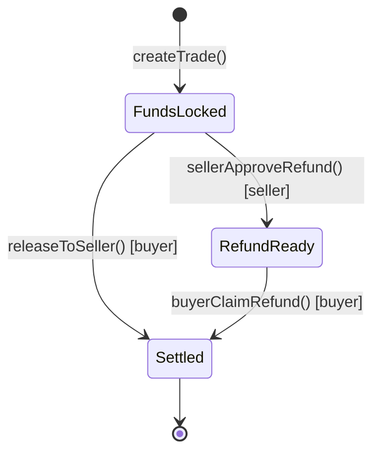

## Contract Overview

VeriPay's core logic lives in a single Solidity smart contract deployed on the Monad blockchain. This contract is the **escrow agent** — it holds funds, enforces trade rules, and executes settlements.

### Deployment Details

| Property | Value |
| --- | --- |
| **Network** | Monad Testnet |
| **Chain ID** | 10143 |
| **Contract Address** | `0xd0cc532f55ce6849d5b70e24d6188073f8921621` |
| **Explorer** | [View on SocialScan](https://monad-testnet.socialscan.io/address/0xd0cc532f55ce6849d5b70e24d6188073f8921621) |
| **Deployment Tool** | [Remix IDE](https://remix.ethereum.org) |
| **Language** | Solidity ^0.8.x |

## Data Model

### The Trade Struct

Every escrow is represented as a `Trade` struct stored in a mapping:

```solidity
struct Trade {
    address buyer;              // The wallet that created the escrow and locked funds
    address seller;             // The wallet designated to receive funds on delivery
    uint256 amount;             // The amount of MON locked in escrow (in wei)
    bool    released;           // True if funds have been released (either to seller or refunded)
    bool    sellerApprovedRefund; // True if the seller has consented to a refund
    string  metadata;           // Human-readable trade description (stored on-chain)
}

mapping(uint256 => Trade) public trades;  // Trade ID → Trade data
uint256 public nextTradeId;               // Auto-incrementing counter
```

### State Machine

Each trade follows a simple state machine:



| State | `released` | `sellerApprovedRefund` | Description |
| --- | --- | --- | --- |
| **Funds Locked** | `false` | `false` | Escrow is active, funds are held |
| **Refund Ready** | `false` | `true` | Seller approved refund, buyer can claim |
| **Settled** | `true` | `*` | Trade is finalized, no further actions |

## Functions

### `createTrade(address _seller, string _metadata)` — payable

Creates a new escrow by locking the sent MON in the contract.

**Parameters:**
| Param | Type | Description |
| --- | --- | --- |
| `_seller` | `address` | The wallet address that will receive funds on delivery |
| `_metadata` | `string` | Trade description (e.g., "iPhone 15 Pro Max, Lagos delivery") |

**Behavior:**
- `msg.value` (the MON sent with the transaction) becomes the escrow amount
- Creates a new `Trade` struct with `released = false` and `sellerApprovedRefund = false`
- Assigns the next available `tradeId` and increments the counter
- Emits `TradeCreated(id, buyer, seller, amount)`

**Example (viem):**
```typescript
import { parseEther } from 'viem';

const hash = await walletClient.writeContract({
  address: CONTRACT_ADDRESS,
  abi: escrowAbi,
  functionName: 'createTrade',
  args: ['0x742d...bD18', 'iPhone 15 Pro Max, Lagos delivery'],
  value: parseEther('0.5'),
});
```

---

### `releaseToSeller(uint256 _id)`

Releases locked funds to the seller. **Only callable by the buyer.**

**Parameters:**
| Param | Type | Description |
| --- | --- | --- |
| `_id` | `uint256` | The trade ID to finalize |

**Requirements:**
- Caller must be `trade.buyer`
- `trade.released` must be `false`

**Behavior:**
- Transfers `trade.amount` MON to `trade.seller`
- Sets `trade.released = true`
- Emits `FundsReleased(id, seller)`

---

### `sellerApproveRefund(uint256 _id)`

Seller consents to a refund. **Only callable by the seller.**

**Parameters:**
| Param | Type | Description |
| --- | --- | --- |
| `_id` | `uint256` | The trade ID |

**Requirements:**
- Caller must be `trade.seller`
- `trade.released` must be `false`

**Behavior:**
- Sets `trade.sellerApprovedRefund = true`
- Emits `RefundAuthorized(id)`

---

### `buyerClaimRefund(uint256 _id)`

Buyer reclaims funds after seller has approved. **Only callable by the buyer.**

**Parameters:**
| Param | Type | Description |
| --- | --- | --- |
| `_id` | `uint256` | The trade ID |

**Requirements:**
- Caller must be `trade.buyer`
- `trade.sellerApprovedRefund` must be `true`
- `trade.released` must be `false`

**Behavior:**
- Transfers `trade.amount` MON back to `trade.buyer`
- Sets `trade.released = true`
- Emits `FundsReleased(id, buyer)`

---

### `trades(uint256)` — view

Returns all data for a specific trade.

**Returns:** `(address buyer, address seller, uint256 amount, bool released, bool sellerApprovedRefund, string metadata)`

---

### `nextTradeId()` — view

Returns the next available trade ID (i.e., the total number of trades created).

## Events

| Event | Parameters | When Emitted |
| --- | --- | --- |
| `TradeCreated` | `id` (indexed), `buyer` (indexed), `seller` (indexed), `amount` | When `createTrade()` succeeds |
| `FundsReleased` | `id` (indexed), `to` | When funds are sent (either to seller or refunded to buyer) |
| `RefundAuthorized` | `id` (indexed) | When seller approves a refund |

## Security Properties

<CardGroup cols={2}>
  <Card title="No Admin Keys" icon="key">
    The contract has no `owner`, no `admin`, and no privileged functions. Nobody — including VeriPay — can drain funds or change contract logic.
  </Card>
  <Card title="Two-Party Consent" icon="users">
    Refunds require explicit seller approval. This prevents buyers from fraudulently reclaiming funds after receiving goods.
  </Card>
  <Card title="Immutable Logic" icon="lock">
    The contract is not upgradeable. The code deployed is the code that runs — forever. This eliminates the risk of malicious upgrades.
  </Card>
  <Card title="Access Control" icon="shield-check">
    Each function checks `msg.sender` against the trade's buyer or seller. No one else can take settlement actions on a trade.
  </Card>
</CardGroup>

## ABI File

The complete ABI is available in the repository:

- **JSON format:** `abi/monad_pay_lagos.json`
- **TypeScript export:** `src/lib/abi.ts`

See the [API Reference](/api-reference/smart-contract-abi) for the full ABI listing and integration examples.
