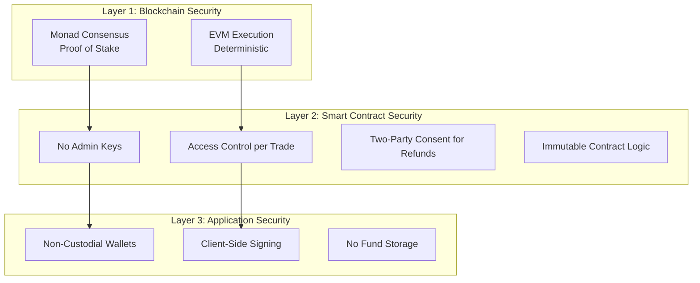

## Trust Model

VeriPay's security philosophy is simple: **trust code, not humans.**

Your funds are protected by a smart contract — a piece of software that runs on the Monad blockchain exactly as programmed. No human, no company, no government can alter its behavior or access the funds it holds.

### The Security Stack

## Smart Contract Security Properties

### No Admin Keys

The escrow contract has **no `owner` function, no admin role, and no privileged access**. This means:

- ❌ VeriPay cannot drain funds from the contract
- ❌ VeriPay cannot pause, modify, or upgrade the contract
- ❌ No single wallet has special permissions over the contract
- ✅ The contract operates autonomously based on its code alone

### Per-Trade Access Control

Every function that moves funds checks `msg.sender` against the trade's recorded participants:

| Function | Required Caller | What It Checks |
| --- | --- | --- |
| `releaseToSeller()` | Buyer | `msg.sender == trade.buyer` |
| `sellerApproveRefund()` | Seller | `msg.sender == trade.seller` |
| `buyerClaimRefund()` | Buyer | `msg.sender == trade.buyer` AND `sellerApprovedRefund == true` |

No third party can take any action on a trade they're not involved in.

### Two-Party Consent for Refunds

Refunds require **explicit consent from the seller**. This is a critical security property:

- **Prevents buyer fraud:** A buyer cannot claim a refund after receiving goods
- **Prevents unilateral action:** Neither party can move funds without the other's involvement
- **Creates accountability:** The seller must actively approve, creating an auditable on-chain action

### Immutability

The contract is **not upgradeable**. There is no proxy pattern, no admin upgrade function, and no way to change the deployed code. This eliminates:

- Malicious upgrade attacks
- "Rug pull" scenarios where contract logic is changed
- Governance attacks on upgrade mechanisms

## Application Security

### Non-Custodial Architecture

VeriPay **never has access to your private keys or funds**:

- All transaction signing happens in your wallet (MetaMask, etc.)
- Social login wallets (email/Google) use Thirdweb's non-custodial in-app wallet — keys are encrypted and only accessible to you
- VeriPay's servers never see, store, or process private keys

### No Fund Storage

VeriPay's API layer handles only **notifications and chat messages** — non-financial data. The application never:

- Holds or transfers funds
- Stores wallet balances
- Has access to contract functions that move money

All fund movements happen directly between the user's wallet and the smart contract.

### Client-Side Transaction Signing

Every blockchain transaction is:
1. Constructed in the user's browser
2. Signed by the user's wallet (requires explicit approval)
3. Submitted directly to the Monad RPC
4. Confirmed on-chain

VeriPay's servers are never in the transaction path.

## What VeriPay Cannot Do

| Action | Possible? | Reason |
| --- | --- | --- |
| Access your funds | ❌ | No admin keys, non-custodial architecture |
| Change contract rules | ❌ | Contract is immutable (not upgradeable) |
| Freeze your escrow | ❌ | No pause function in the contract |
| Release funds without your approval | ❌ | Only the buyer can release, only the buyer can claim refund |
| See your private keys | ❌ | Keys never leave your wallet |
| Rug pull | ❌ | No owner, no admin, no privileged functions |
